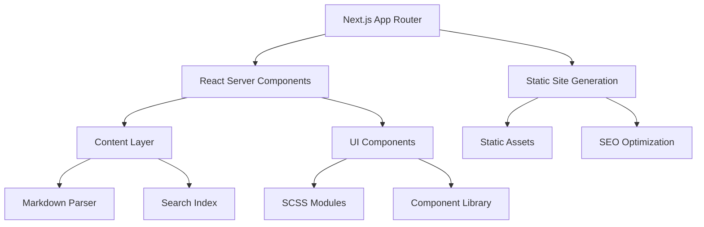

# Design Document

## Overview

The Jekyll to Next.js migration will create a modern, performant blog application in the `nextjs-theme-ade` subdirectory that maintains the existing aesthetic while leveraging contemporary web development practices. The architecture follows Next.js 14+ App Router patterns with TypeScript, implements a headless CMS approach using Markdown files, and includes comprehensive enterprise tooling for development, testing, and deployment.

## Architecture

### High-Level Architecture



### Technology Stack

**Core Framework:**
- Next.js 14+ with App Router
- React 18+ with Server Components
- TypeScript 5+ with strict mode

**Content Management:**
- MDX for enhanced Markdown processing
- Gray-matter for frontmatter parsing
- Remark/Rehype plugins for content transformation

**Styling:**
- SCSS with CSS Modules
- PostCSS for vendor prefixing
- Tailwind CSS for utility classes (optional)

**Search & Data:**
- Fuse.js for client-side fuzzy search
- Custom query builder with TypeScript
- JSON-based search index generation

**Development Tools:**
- ESLint + Prettier for code quality
- Jest + React Testing Library for testing
- Storybook for component development
- Husky for git hooks
- TypeDoc for documentation

**Build & Deployment:**
- Webpack bundle analyzer
- Next.js static export
- Vercel/Netlify deployment ready

## Components and Interfaces

### Core Components Hierarchy

```
src/
├── app/                    # Next.js App Router
│   ├── layout.tsx         # Root layout
│   ├── page.tsx           # Homepage
│   ├── blog/              # Blog routes
│   └── search/            # Search page
├── components/            # Reusable components
│   ├── ui/               # Basic UI components
│   ├── layout/           # Layout components
│   ├── content/          # Content-specific components
│   └── search/           # Search components
├── lib/                  # Utility libraries
│   ├── content.ts        # Content management
│   ├── search.ts         # Search functionality
│   └── query.ts          # Query system
├── types/                # TypeScript definitions
├── styles/               # Global styles and themes
└── content/              # Markdown content
    ├── posts/            # Blog posts
    └── pages/            # Static pages
```

### Key Interfaces

```typescript
// Content Types
interface Post {
  slug: string;
  title: string;
  date: Date;
  categories: string[];
  tags: string[];
  excerpt?: string;
  content: string;
  author?: string;
  featured_image?: string;
}

interface Page {
  slug: string;
  title: string;
  content: string;
  description?: string;
  date?: Date;
}

// Search Types
interface SearchIndex {
  textContent: string;
  href: string;
  words: string[];
  categories: string[];
  tags: string[];
}

interface SearchResult {
  item: SearchIndex;
  score: number;
  matches: SearchMatch[];
}

// Query System Types
interface QueryOptions {
  years?: number[];
  months?: number[];
  days?: number[];
  categories?: string[];
  tags?: string[];
  orderBy?: 'title' | 'date' | 'categories' | 'tags';
  order?: 'asc' | 'desc';
  limit?: number;
  offset?: number;
  groupBy?: string[];
  groupByOrder?: 'asc' | 'desc';
}

interface QueryResult<T> {
  items: T[];
  total: number;
  hasMore: boolean;
}
```

### Component Architecture

**Layout Components:**
- `RootLayout`: Main application wrapper with metadata
- `Header`: Site navigation with search integration
- `Footer`: Copyright and social links
- `Navigation`: Mobile-responsive menu system

**Content Components:**
- `PostCard`: Individual post preview
- `PostList`: Collection of post cards with pagination
- `PostContent`: Full post display with syntax highlighting
- `CategoryFilter`: Filter posts by category
- `TagCloud`: Visual tag representation

**Search Components:**
- `SearchInput`: Real-time search with suggestions
- `SearchResults`: Formatted search result display
- `SearchHighlight`: Text highlighting utility

**UI Components:**
- `Button`: Consistent button styling
- `Icon`: SVG icon system
- `Loading`: Loading states and skeletons
- `ErrorBoundary`: Error handling wrapper

## Data Models

### Content Structure

```typescript
// Frontmatter Schema
interface PostFrontmatter {
  title: string;
  date: string;
  categories: string[];
  tags: string[];
  excerpt?: string;
  author?: string;
  featured_image?: string;
  draft?: boolean;
}

// Processed Content
interface ProcessedPost extends PostFrontmatter {
  slug: string;
  content: string;
  readingTime: number;
  wordCount: number;
  toc?: TableOfContents[];
}
```

### Search Index Schema

```typescript
interface SearchDocument {
  id: string;
  type: 'post' | 'page';
  title: string;
  content: string;
  excerpt: string;
  url: string;
  categories: string[];
  tags: string[];
  date: string;
  keywords: string[];
}

// Trie structure for efficient search
interface TrieNode {
  [key: string]: TrieNode | SearchDocument[];
}
```

### Query System Data Model

```typescript
// Query Builder Pattern
class ContentQuery {
  private filters: QueryFilters = {};
  private sorting: SortOptions = { field: 'date', order: 'desc' };
  private pagination: PaginationOptions = { limit: 10, offset: 0 };

  filterByCategory(categories: string[]): ContentQuery;
  filterByTag(tags: string[]): ContentQuery;
  filterByDateRange(start: Date, end: Date): ContentQuery;
  sortBy(field: string, order: 'asc' | 'desc'): ContentQuery;
  paginate(limit: number, offset: number): ContentQuery;
  groupBy(fields: string[]): ContentQuery;
  execute(): Promise<QueryResult>;
}
```

## Error Handling

### Error Boundary Strategy

```typescript
// Global Error Boundary
interface ErrorBoundaryState {
  hasError: boolean;
  error?: Error;
  errorInfo?: ErrorInfo;
}

// Error Types
enum ErrorType {
  CONTENT_NOT_FOUND = 'CONTENT_NOT_FOUND',
  SEARCH_FAILED = 'SEARCH_FAILED',
  BUILD_ERROR = 'BUILD_ERROR',
  RUNTIME_ERROR = 'RUNTIME_ERROR'
}

// Error Handling Utilities
interface ErrorHandler {
  logError(error: Error, context: string): void;
  reportError(error: Error, user?: User): void;
  recoverFromError(error: Error): RecoveryAction;
}
```

### Content Validation

```typescript
// Content Validation Schema
const PostSchema = z.object({
  title: z.string().min(1),
  date: z.string().datetime(),
  categories: z.array(z.string()).min(1),
  tags: z.array(z.string()).min(1),
  content: z.string().min(1),
  excerpt: z.string().optional(),
  draft: z.boolean().default(false)
});

// Validation Pipeline
interface ContentValidator {
  validateFrontmatter(frontmatter: unknown): PostFrontmatter;
  validateContent(content: string): string;
  validateImages(content: string): ImageValidationResult;
}
```

## Testing Strategy

### Testing Pyramid

**Unit Tests (70%):**
- Component rendering and props
- Utility functions and helpers
- Content parsing and validation
- Search functionality
- Query system logic

**Integration Tests (20%):**
- Page routing and navigation
- Search integration with content
- Content loading and display
- Form submissions and interactions

**End-to-End Tests (10%):**
- Critical user journeys
- Search workflow
- Content publishing workflow
- Mobile responsiveness

### Testing Tools and Patterns

```typescript
// Component Testing Pattern
describe('PostCard', () => {
  const mockPost: Post = {
    slug: 'test-post',
    title: 'Test Post',
    date: new Date('2024-01-01'),
    categories: ['tech'],
    tags: ['react'],
    content: 'Test content',
    excerpt: 'Test excerpt'
  };

  it('renders post information correctly', () => {
    render(<PostCard post={mockPost} />);
    expect(screen.getByText('Test Post')).toBeInTheDocument();
    expect(screen.getByText('Test excerpt')).toBeInTheDocument();
  });
});

// Search Testing
describe('Search Functionality', () => {
  it('returns relevant results for query', async () => {
    const searchIndex = await buildSearchIndex(mockPosts);
    const results = searchContent('react', searchIndex);
    expect(results).toHaveLength(2);
    expect(results[0].item.title).toContain('React');
  });
});
```

### Performance Testing

```typescript
// Performance Benchmarks
interface PerformanceMetrics {
  searchLatency: number;      // < 100ms
  pageLoadTime: number;       // < 2s
  buildTime: number;          // < 5min
  bundleSize: number;         // < 500KB
  lighthouseScore: number;    // > 90
}

// Performance Monitoring
const performanceMonitor = {
  measureSearchPerformance: (query: string) => number,
  measurePageLoad: (route: string) => Promise<number>,
  analyzeBundleSize: () => BundleAnalysis,
  runLighthouseAudit: () => Promise<LighthouseResult>
};
```

## Implementation Phases

### Phase 1: Foundation Setup
- Next.js project initialization with TypeScript
- Basic project structure and configuration
- ESLint, Prettier, and Husky setup
- Initial component library with Storybook

### Phase 2: Content Management
- Markdown parsing with MDX
- Content type definitions and validation
- Static page generation
- Basic routing structure

### Phase 3: UI Implementation
- Layout components (Header, Footer, Navigation)
- Content display components
- Responsive design implementation
- Dark theme styling with SCSS

### Phase 4: Search Functionality
- Search index generation
- Client-side search implementation
- Search UI components
- Real-time search suggestions

### Phase 5: Advanced Features
- Query system implementation
- Content filtering and sorting
- Social media integration
- SEO optimization

### Phase 6: Testing and Optimization
- Comprehensive test suite
- Performance optimization
- Bundle analysis and code splitting
- Accessibility improvements

### Phase 7: Deployment and Monitoring
- CI/CD pipeline setup
- Deployment configuration
- Performance monitoring
- Documentation completion

## Security Considerations

### Content Security
- Input sanitization for Markdown content
- XSS prevention in dynamic content
- Safe HTML rendering with DOMPurify
- Content validation and type checking

### Build Security
- Dependency vulnerability scanning
- Secure environment variable handling
- Build artifact integrity checks
- Supply chain security measures

### Runtime Security
- CSP headers configuration
- HTTPS enforcement
- Secure cookie handling
- Error information sanitization